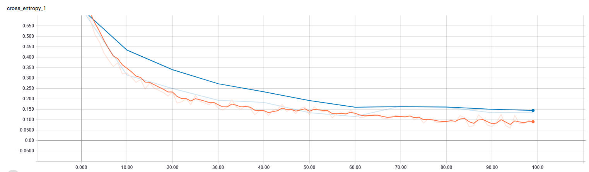

# tensorflow-transfer-learning-image-classification

This repo reuses the tensorflow image retraining tutorial code to retrain the classification layers of the Inception V3 convolutional neural network to classify dachshunds and jack russell terriers. This process can be repeated with different classes by uploading different image folders to the data folder.

## Data

### Getting the data
You can pull images from Google images. There is a useful extension called [Fatkun Batch Download Image](https://chrome.google.com/webstore/detail/fatkun-batch-download-ima/nnjjahlikiabnchcpehcpkdeckfgnohf). You can download all the images currently loaded on the web page with this extension. For each class/label download the images and move the folder to the [data](data) folder. The name of the folder becomes the label the model will learn.


### Remove all extensions not supported by tensorflow

```
find . -type f  ! -name *.png ! -name *.PNG ! -name *.gif  ! -name *.GIF ! -name *.jpeg ! -name *.JPEG  ! -name *.jpg ! -name *.JPG -delete
```

### Remove corrupt files
Some files downloaded online may be corrupt and cause an exception during training. [clean.py](clean.py) tests each image validity and renames the valid files to `data-sample-#.jpg`. 

Run the clean up script

```
python clean.py
```

Delete the invalid files

```
find . -type f ! -name "data-sample-*" -delete
```

## Setting up dev environment

For retraining we need to install tensorflow 1.12 and 1.13 and tensorflow-hub. 

```
conda create --name tf12 tensorflow-gpu=1.12
conda create --name tf13 tensorflow-gpu=1.13
conda activate tf12
conda install -c conda-forge tensorflow-hub
```

## Training

Run [retrain.bat](retrain.bat). Should be easy to update file if using linux.

```
retrain.bat
```

You will see output for `bottleneck files created` and a `Final test accuracy = 96.7%`


## Testing
```
conda activate tf13
```

Run [test.bat](test.bat). Should be easy to update file if using linux.

```
test.bat
```

### Dachshund Test


```
dachshunds 0.97510725
jack russell terrier 0.024892714
```

### Jack Russell Test


```
jack russell terrier 0.86457354
dachshunds 0.13542639
```

## Charts

Orange: Test

Blue: Validation

### Accuracy


### Cross entropy

